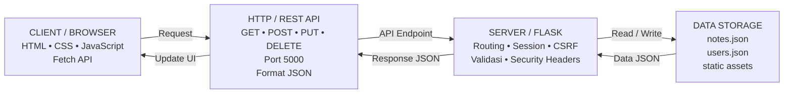

# 📘 MBG - Memo Belajar Digital

**MBG (Memo Belajar Digital)** adalah aplikasi **note taking berbasis client-server** yang dibuat sebagai tugas akhir mata kuliah **Client Server Programming**.
Aplikasi ini terinspirasi dari konsep aplikasi catatan seperti **Google Keep**, dengan fitur utama untuk membuat, melihat, mengedit, menghapus, memberi label, menandai favorit, serta mengelola catatan melalui antarmuka web sederhana.

---

## 👤 Identitas Mahasiswa

| Keterangan     | Data                      |
| -------------- | ------------------------- |
| Nama           | Rendi Aigo Brandon        |
| NIM            | 23343082                  |
| Program Studi  | Informatika               |
| Universitas    | Universitas Negeri Padang |
| Mata Kuliah    | Client Server Programming |
| Dosen Pengampu | Vikri Aulia, S.Pd, M.Kom  |

---

## 🎯 Tujuan Project

Project ini dibuat untuk menerapkan konsep **client-server** dalam bentuk aplikasi web sederhana.
Aplikasi MBG menunjukkan bagaimana browser sebagai **client** berkomunikasi dengan server Flask melalui **HTTP REST API**, lalu data disimpan dalam file **JSON**.

---

## ✨ Fitur Aplikasi

* 🔐 Login dan logout sederhana
* 📝 Tambah catatan baru
* 📋 Menampilkan daftar catatan dalam bentuk card
* 🔎 Melihat detail catatan
* ✏️ Edit catatan
* 🗑️ Hapus catatan
* 🏷️ Sistem label / tag
* ⭐ Favorit catatan
* 📅 Deadline catatan
* 🔍 Search catatan
* ↕️ Sort / urutkan catatan
* 📌 Sidebar navigasi seperti Google Keep
* 🖱️ Hover action buttons pada card catatan
* 🔊 Efek suara buku saat membuka atau membuat catatan
* 📄 Animasi kertas terbuka saat melihat catatan

---

## 🛠️ Teknologi yang Digunakan

| Bagian      | Teknologi                                          |
| ----------- | -------------------------------------------------- |
| Backend     | Python Flask                                       |
| Frontend    | HTML, CSS, JavaScript                              |
| Komunikasi  | HTTP REST API                                      |
| Format Data | JSON                                               |
| Penyimpanan | `notes.json`, `users.json`                         |
| Keamanan    | Session, CSRF Token, Password Hash, Validasi Input |
| UI/UX       | Google Keep-style layout                           |

---

## 🧩 Arsitektur Client-Server

Aplikasi **MBG (Memo Belajar Digital)** menggunakan arsitektur **client-server berbasis web**.
Browser berperan sebagai **client**, Flask berperan sebagai **server**, sedangkan data catatan dan akun disimpan dalam file **JSON**.



### Alur Kerja Aplikasi

1. User membuka aplikasi MBG melalui browser.
2. User login menggunakan akun demo.
3. Browser mengirim request ke server Flask melalui HTTP.
4. Server memproses request melalui endpoint REST API.
5. Data catatan dibaca atau ditulis ke file `notes.json`.
6. Server mengirim response dalam format JSON ke browser.
7. Browser memperbarui tampilan catatan tanpa reload halaman penuh.

### Pembagian Komponen

| Komponen     | Implementasi               | Fungsi                                                     |
| ------------ | -------------------------- | ---------------------------------------------------------- |
| Client       | HTML, CSS, JavaScript      | Menampilkan UI dan mengirim request ke server              |
| Server       | Python Flask               | Memproses routing, login, REST API, validasi, dan keamanan |
| Data Storage | `notes.json`, `users.json` | Menyimpan data catatan dan akun pengguna                   |
| Komunikasi   | HTTP + Fetch API           | Menghubungkan client dan server                            |
| Format Data  | JSON                       | Format pertukaran data antara client dan server            |


## 📁 Struktur Folder

```text
UAS_Clientserver_MBG_Rendiaigobrandon_23343082/
│
├── app.py
├── requirements.txt
├── README.md
├── JALANKAN_WINDOWS.bat
├── notes.json
├── users.json
│
├── templates/
│   ├── index.html
│   └── login.html
│
└── static/
    ├── style.css
    ├── script.js
    ├── login.js
    ├── logo-mbg.png
    └── sounds/
        └── book-open.mp3
```

---

## 🔑 Akun Demo

Gunakan akun berikut untuk login:

```text
Username : admin
Password : mbg12345
```

---

## 🚀 Cara Menjalankan Aplikasi

### 1. Clone atau Download Project

```bash
git clone https://github.com/username/nama-repository.git
cd UAS_Clientserver_MBG_Rendiaigobrandon_23343082
```

Atau download ZIP dari GitHub, lalu ekstrak folder project.

---

### 2. Install Library yang Dibutuhkan

Pastikan Python sudah terinstall, lalu jalankan:

```bash
pip install -r requirements.txt
```

---

### 3. Jalankan Server Flask

```bash
python app.py
```

Jika berhasil, terminal akan menampilkan alamat lokal:

```text
http://127.0.0.1:5000
```

---

### 4. Buka Aplikasi di Browser

Buka browser, lalu akses:

```text
http://127.0.0.1:5000
```

Login menggunakan akun demo:

```text
admin / mbg12345
```

---

## ⚡ Cara Cepat di Windows

Project ini juga menyediakan file:

```text
JALANKAN_WINDOWS.bat
```

Untuk menjalankan aplikasi dengan cepat, klik dua kali file tersebut atau jalankan melalui terminal:

```bash
JALANKAN_WINDOWS.bat
```

---

## 🔗 Endpoint REST API

| Method | Endpoint             | Fungsi                          |
| ------ | -------------------- | ------------------------------- |
| GET    | `/api/notes`         | Mengambil daftar catatan        |
| POST   | `/api/notes`         | Menambah catatan baru           |
| PUT    | `/api/notes/<id>`    | Mengubah catatan                |
| DELETE | `/api/notes/<id>`    | Menghapus catatan               |
| GET    | `/api/labels`        | Mengambil daftar label          |
| POST   | `/api/notes/reorder` | Menyimpan urutan manual catatan |

---

## 🧪 Pengujian

Pengujian dilakukan menggunakan metode **black-box testing**, yaitu menguji aplikasi berdasarkan input dan output yang muncul pada tampilan.

Skenario pengujian yang dilakukan:

| No | Skenario                      | Status   |
| -- | ----------------------------- | -------- |
| 1  | Login menggunakan akun demo   | Berhasil |
| 2  | Menampilkan dashboard catatan | Berhasil |
| 3  | Menambah catatan baru         | Berhasil |
| 4  | Membuka detail catatan        | Berhasil |
| 5  | Mengedit catatan              | Berhasil |
| 6  | Menghapus catatan             | Berhasil |
| 7  | Menggunakan label             | Berhasil |
| 8  | Search catatan                | Berhasil |
| 9  | Sort catatan                  | Berhasil |
| 10 | Hover action buttons          | Berhasil |

---

## 🔐 Keamanan Dasar

Aplikasi MBG menerapkan beberapa keamanan dasar, yaitu:

* Login dan session
* Password hash
* CSRF token
* Validasi input
* Escape output untuk mengurangi risiko XSS
* Security headers
* RLock untuk menjaga konsistensi baca/tulis file JSON

> Catatan: aplikasi ini dibuat untuk kebutuhan pembelajaran dan berjalan di localhost. Untuk deployment publik, aplikasi perlu dikembangkan lagi dengan HTTPS, database server, dan autentikasi multi-user yang lebih kuat.

---

## 📌 Keterbatasan Aplikasi

Aplikasi MBG masih memiliki beberapa keterbatasan:

* Masih berjalan di localhost
* Penyimpanan masih menggunakan file JSON
* Belum menggunakan database seperti SQLite, MySQL, PostgreSQL, atau MongoDB
* Belum mendukung sinkronisasi cloud
* Belum mendukung kolaborasi real-time
* Belum menggunakan HTTPS untuk deployment publik

---

## 💡 Saran Pengembangan

Pengembangan selanjutnya dapat dilakukan dengan:

* Mengganti JSON storage menjadi database
* Menambahkan sistem multi-user
* Menambahkan fitur arsip dan pin catatan
* Menambahkan reminder otomatis
* Menambahkan cloud synchronization
* Menggunakan HTTPS/TLS untuk deployment publik
* Menambahkan fitur export catatan ke PDF atau TXT

---

## 📚 Referensi

1. Mozilla Developer Network. (n.d.). *Overview of HTTP*. MDN Web Docs.
   https://developer.mozilla.org/en-US/docs/Web/HTTP/Guides/Overview

2. Red Hat. (2020). *What is a REST API?* Red Hat.
   https://www.redhat.com/en/topics/api/what-is-a-rest-api

3. IBM. (n.d.). *What is three-tier architecture?* IBM Think.
   https://www.ibm.com/think/topics/three-tier-architecture

4. Pallets Projects. (n.d.). *Quickstart — Flask Documentation*. Flask Documentation.
   https://flask.palletsprojects.com/en/stable/quickstart/

5. Python Software Foundation. (n.d.). *json — JSON encoder and decoder*. Python Documentation.
   https://docs.python.org/3/library/json.html

6. OWASP Foundation. (n.d.). *Cross-Site Request Forgery Prevention Cheat Sheet*. OWASP Cheat Sheet Series.
   https://cheatsheetseries.owasp.org/cheatsheets/Cross-Site_Request_Forgery_Prevention_Cheat_Sheet.html

7. Mozilla Developer Network. (n.d.). *HTTP request methods*. MDN Web Docs.
   https://developer.mozilla.org/en-US/docs/Web/HTTP/Reference/Methods

---

## 📄 Lisensi

Project ini dibuat untuk kebutuhan akademik mata kuliah **Client Server Programming**.
Penggunaan ulang diperbolehkan untuk pembelajaran dengan mencantumkan sumber.

---

## ✅ Status Project

Project selesai untuk kebutuhan UAS dan sudah memenuhi fitur utama implementasi sederhana aplikasi note taking berbasis client-server.

```text
Status: Selesai
Versi: 1.0
Mode: Localhost Demo
```
